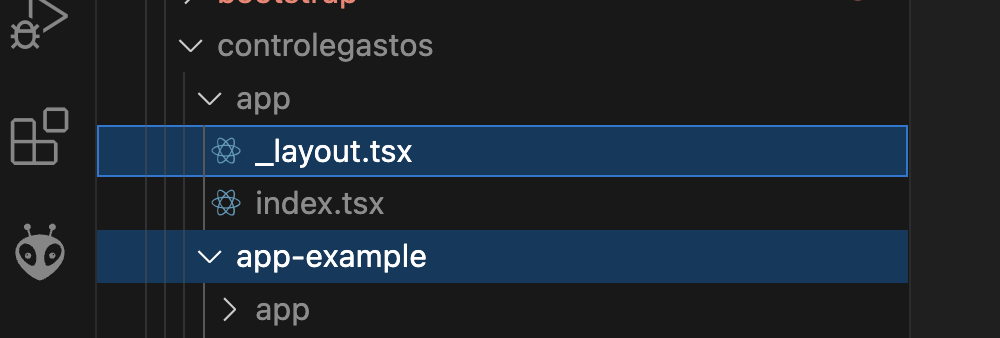

## React Native

- [NodeJs Download](https://nodejs.org/en/download)
- [React Native](https://reactnative.dev/)
- [VS Code](https://code.visualstudio.com/download)
- [Android Studio / SDK](https://developer.android.com/studio)

- Componentes visuais do React Native são compilados nativamente para as respectivas plataformas (iOS, Android, etc...)
- Lógica de negócio permanece em *JavaScript*

### Criação do Projeto
- No caso específico de Mac digitar no terminal: `export NODE_OPTIONS=--max-old-space-size=4096`
- Criar o projeto (`npx create-expo-app controlegastos`)
    ```
    cd controlegastos
    npm run reset-project
    npm run android
    ```
- A pasta `app-example` e o arquivo `_layout.tsx` podem ser apagados
- 
- Pasta `assets` pode ser utilizada para armazenar imagens utilizadas pelo app
- Arquivo `App.js` contém o código fonte
- Principais blocos: 
    - import
    - código
    - estilos
- Função `Index()`indica o ponto de entrada do app
- O retorno desta função deve representar o desenho da interface de usuário que será convertida para eleentos nativos na plataforma específica (ios, android, web, etc...)
    ```javascript
    export default function Index() {
        return null;
    }
    ```
- [Lista dos Componentes Visuais e APIs](https://reactnative.dev/docs/components-and-apis)
***
#### `<Text>`
- Importar `import { Text } from 'react-native';`
- Exibe um texto estático
- Podem ser utlizadas expressões dentro do texto
- Para processar expressões é necessário utilizar os símbolos `{` e `}`
- Por exemplo:
    ```javascript
    export default function App() {
    var variavel = 'Ok!'
    return <Text>Tudo certo = {variavel}, 2 + 2 = {2 + 2}</Text>
    }
    ```
- Estilos podem ser aplicados localmente `style={{margin: 100}}`
    ```javascript
    export default function App() {
        var variavel = 'Ok!'
        return <Text style={{margin: 100}}>Tudo certo = {variavel}, 2 + 2 = {2 + 2}</Text>
    }
    ```
***
#### `<View>`
- Importar `import { View } from 'react-native';`
- Representa um container para demais componentes React onde estilos podem ser aplicados globalmente
    ```javascript
    export default function App() {
    var variavel = 'Ok!'
    const texto = () => {
        return "Boa noite!";
    }
    return <View style={{margin: 100, borderWidth: 5}}>
                <Text>Tudo certo = {variavel}</Text>
                <Text>2 + 2 = {2 + 2}</Text>
                <Text>{texto()}</Text>
            </View>
    }
    ```
***
#### Estilos
- Importar `import { StyleSheet } from 'react-native';`
- Utilizar o método utilitário `StyleSheet.create` para criar objetos de estilo
- São "semelhantes" ao **css** mas não são iguais!!!!
    ```javascript
    const styles = StyleSheet.create({
    container: {
        flex: 1, // ocupa toda a dimensão vertical
        marginTop: '10%',
        borderWidth: 5,
        borderColor: 'red'
    }});
    ```
- Referenciar com a propriedade `style={objeto_estilo.nome_estilo}`
    ```javascript
    export default function App() {
    var variavel = 'Ok!'
    return <View style={styles.container}>
                <Text>Tudo certo = {variavel}</Text>
                <Text>2 + 2 = {2 + 2}</Text>
            </View>
    }
    ```
***
#### Controle de Estado em React
- Controle de estado é um conceito fundamental em **React**
- Estado representa o valor das variáveis em um determinado momento
- Caso o estado de uma variável seja alterado internamente pode-se desejar que esta alteração seja refletida na interface de usuário
    ```javascript
    export default function App() {

    let contador = 0;
    const contar = () => {
        contador++;
    }

    return <View style={styles.container}>
            <Text style={{textAlign: 'center'}}>{contador}</Text>
            <Button title='Contar' onPress={contar}/>
            </View>
    }
    ```
- O exemplo acima não funciona, o contador não é atualizado na interface
- Para que isso seja feito é necessário o uso do `useState`
```javascript
  import { useState } from 'react';
  // variável contador somente leitura
  // para alterar seu valor utilizar a função incContador
  const [contador, incContador] = useState(0);

  const contar = () => {
    // atribuir o valor atual de contador a outra variável
    let newContador = contador;
    // atualizar o novo valor utilizando o incContador
    incContador(++newContador);
  }
```
***
#### `<TextInput>`
- Importar `import { TextInput } from 'react-native';`
- Permite a entrada de um texto
- Deve ser associado a uma variável de estado `useState`
- Principais propriedades:
  - `style` - define o estilo
  - `onChangeText` - associado à função de controle de estado (`useState`)
  - `value` - valor digitado e associado à variável de estado (`useState`)
 #### Exemplo `<TextInput>`
- Importar controle de estado do React: `import { useState } from 'react';`
- Criar uma variável de estado chamada `descricaoGasto`
  ```javascript
  const [descricaoGasto, onChangeDescricaoGasto] = useState('');
  ```
- Criar um manipulador para o texto inserido:
  ```javascript
  const descricaoGastoHandler = (texto: string) => {
    console.log(texto);
    onChangeDescricaoGasto(texto);
  }
  ```
- Definir o `<TextInput>`:
  ```javascript
  <TextInput style={styles.input} 
             value={descricaoGasto} 
             onChangeText={descricaoGastoHandler}
             placeholder="Descrição do Gasto"/>
  ```
- Definir o estilo (`width: "100%"` para ocupar a largura disponível):
```css
input: {
    height: 50,
    width: "90%",
    marginVertical: 10,
    paddingHorizontal: 15,
    borderRadius: 10,
    borderWidth: 1,
    borderColor: "#ccc",
    backgroundColor: "#f9f9f9",
    shadowColor: "#000",
    shadowOffset: { width: 0, height: 2 },
    shadowOpacity: 0.1,
    shadowRadius: 4,
    elevation: 3,
    fontSize: 16,
    color: "#333",
  },
  inputFocused: {
    borderColor: "#4A90E2",
    backgroundColor: "#fff",
  },
```
- [Gerador Shadow](https://10015.io/tools/react-native-shadow-generator)
***
#### Exibindo o Texto Digitado
- Criar o `<Text>`:
```javascript
<Text>{descricaoGasto}</Text>
```
#### `<Button>`
- Importar `import { Button } from 'react-native';`
- Botão que pode ser pressionado
- Principais propriedades:
  - `style` - define o estilo
  - `onPress` - função acionada quando o botão é pressionado
  - `title` - rótulo do botão
***
#### Exemplo `<Button>`
- Criar um `<Button>`
  ```javascript
  <Button title="Adicionar" onPress={addDescricaoGastoHandler}/>
  ```
- Criar um manipulador a ser acionado quando o botão for pressionado:
  ```javascript
  const addDescricaoGastoHandler = () => {
    console.log(descricaoGasto);
  }
  ```
- Para configurar margens, altura, etc... deve-se colocar o botão dentro de uma `<View>`
  ```javascript
  <View style={[{ width: "90%", margin: 2, backgroundColor: "red" }]}>
    <Button title='Incrementar' onPress={incrementarValor} />
  </View>
  ```
- Uma melhor abordagem ao `<Button>` é utilizar o `<Pressable>`
```javascript
<Pressable style={({ pressed }) => [styles.button, pressed && styles.buttonPressed]}
  onPress={addDescricaoGastoHandler} >
  <Text style={styles.buttonText}>Adicionar</Text>
</Pressable>
```
- Explicação para o `({ pressed }) => [styles.button, pressed && styles.buttonPressed]`:
    - `pressed`: indica se o botão foi pressionado (`true`) ou não (`false`)
    - `[styles.button, pressed && styles.buttonPressed]`: é uma combinação de estilos (permitido pelo **React Native**)
- Com o estilo abaixo
```css
button: {
  backgroundColor: "#4A90E2",
  paddingVertical: 14,
  paddingHorizontal: 25,
  borderRadius: 10,
  alignItems: "center",
  justifyContent: "center",
  shadowColor: "#000",
  shadowOffset: { width: 0, height: 2 },
  shadowOpacity: 0.15,
  shadowRadius: 3.5,
  elevation: 3,
  marginVertical: 10,
  width: "90%",
},
buttonText: {
  color: "#fff",
  fontSize: 16,
  fontWeight: "600",
},
buttonPressed: {
  backgroundColor: "#357ABD"
}
```
- Existe também o `<TouchableOpacity>` que é mais antigo que o `<Pressable>`
```javascript
<TouchableOpacity style={styles.button}
  activeOpacity={0.7}
  onPress={addDescricaoGastoHandler} >
  <Text style={styles.buttonText}>Entrar</Text>
</TouchableOpacity>
```
***
#### Ajustando o Layout
- Organizar os layout da aplicação utilizando `<View>`
```javascript
<View style={styles.container}>
    {/* Área superior: input + botão */}
    <View style={styles.topSection}>

    </View>

    {/* Área inferior: lista de gastos */}
    <View style={styles.listSection}>
        <Text style={styles.listPlaceholder}>A lista de gastos aparecerá aqui...</Text>
    </View>
</View>
```
- As folhas de estilos para cada uma das sessões é definda abaixo
```css
container: {
  flex: 1,
  backgroundColor: "#fff",
  padding: 20,
},
topSection: {
  marginTop: 20,
  marginBottom: 15,
  alignItems: "center",
},
listSection: {
  flex: 1,
  marginTop: 20,
  backgroundColor: "#f4f6f8",
  borderRadius: 12,
  padding: 15,
},
listPlaceholder: {
  color: "#666",
  fontSize: 14,
  fontStyle: "italic",
  textAlign: "center",
  marginTop: 20,
},
```
***
### SafeAreaView e StatusBar
- Delimita a região visível da aplicação e uma barra de status
```javascript
<SafeAreaView style={styles.safeArea}>
  <StatusBar />
  {/* Os demais componentes vão aqui */}
</SafeAreaView>
```
- Observação: importar de `import { SafeAreaView } from "react-native-safe-area-context";`
- Definir o estilo para o `SafeAreaView`
```css
safeArea: {
  flex: 1,
  backgroundColor: "#fff", // mantém cor uniforme
},
```
***
#### Armazenar Gastos em Uma Lista
- **Nota:** como concatenar *arrays* em *Javascript* utilizando **spread** (`...`)
```javascript
const letras = ["A", "B", "C"];
const maisLetras = [letras, "D"];
console.log(maisLetras);
```
- Resultado: `[["A", "B", "C"], "D"]` - um *array* dentro de outro
```javascript
console.log(...letras)
```
- Concatenação com o **spread** (`...`):
```javascript
const maisLetras = [...letras, "D"];
console.log(maisLetras)
```
- **Nota:** utilizando `map` para percorrer elementos de um *array*
```javascript
maisLetras.map((item) => console.log(item))
```
- Criar uma variável de estado para armazenar a lista de gastos:
```javascript
  const [listaGastos, setListaGastos] = useState<string[]>([]);
```
- Alterar a função acionada quando o botão é pressionado:
  ```javascript
  const addDescricaoGastoHandler  = () => {
    setListaGastos((gastosAtuais) => {
      console.log([...gastosAtuais, descricaoGasto]);
      return [...gastosAtuais, descricaoGasto];
    });
  }
  ```
- Os itens devem ser exibidos em uma lista contento `<Text>` para cada elemento
- Utilizar a função `map` do javascript para percorrer os elementos da lista
```javascript
{listaGastos.map((gasto) => <Text key={gasto}>{gasto}</Text>)}
```
***
### Trabalhando com Classes Typescript
- Criar uma classe para representar os gastos que serão instanciados
```javascript
type Gasto = { id: number, descricao: string, valor: number };
```
- Alterar a variável de estado
```javascript
const [listaGastos, setListaGastos] = useState<Gasto[]>([]);
```
- Ajustar a inclusão de um novo gasto na lista
```javascript
const addDescricaoGastoHandler = () => {
  const gasto: Gasto = {
    id: Date.now(),
    descricao: descricaoGasto,
    valor: 0.0,
  };

  const novoGasto = [...listaGastos, gasto];
  setListaGastos(novoGasto);
}
```
- Alterar a forma de exibir os itens registrados até o momento na lista
```javascript
{listaGastos.map((gasto) => <Text key={gasto.id}>{gasto.descricao}</Text>)}
```
***
### FlexBox
- Permite distribuir os componentes visuais proporcionalmente na área de visualização
- A propriedade `flexDirecion` define como os componentes dentro da `<View>` serão distribuídos
  - `row`: alinhados lado a lado (linha)
  - `column`: alinhados um abaixo do outro (coluna) - *Default*
- Cada componente dentro da `<View>` tem uma propriedade `flex` para indicar o quanto de espaço irá ocupar
- No exemplo baixo, 1 + 4 = 5, então **Item 1** irá ocupar 1/5 do espaço horizontal
- Já o **Item 2** irá ocupar 4/5
```javascript
<View style={{marginTop: 50, flexDirection:'row'}}>
    <Text style={{flex: 1, borderColor: 'red', borderWidth: 1}}>Item 1</Text>
    <Text style={{flex: 4, borderColor: 'red', borderWidth: 1}}>Item 2</Text>
</View>
```
***
#### `<Image>`
- Importar `import { Image } from 'react-native';`
- Permite incluir imagens
- Os arquivos de imagem podem ser armazenados dentro da pasta `assets`
- Exemplo (copiar o arquivo `001-coin.png` para a pasta `assets`):
`<Image source={require('../assets/001-coin.png')}/>`
- A imagem acima pode ser obtida [aqui](https://github.com/esensato/mobile-2025-02/blob/main/img/001-coin.png)
***
#### `<FlatList>`
- Exibe uma lista de itens de forma otimizada:
  - `data`: lista contendo os valores a serem exibidos
  - `renderItem`: como os itens da lista serão exibidos visualmente - recebe como parâmetro um objeto JSON com os atributos `item` (texto) e `index` (índice do item no *array* mapeado para `data`)
  - `keyExtractor`: chaves únicas para cada item da lista - recebe como parâmetro o índice do elemento no *array* indicado em `data`
***
#### Exibir Gastos na FlatList
- Para organizar o código, criar uma função que retorna o item a ser exibido em cada linha da lista
```javascript
const renderGasto = ({ item, index }: { item: Gasto, index: number }) => {
  return (
    <View style={styles.gastoCard}>
      <Image source={require("./assets/001-coin.png")} style={styles.gastoIcon}/>
      <Text style={styles.gastoDescricao}>{item.descricao}</Text>
      <Text style={styles.gastoValor}>R$ {item.valor.toFixed(2)}</Text>
    </View>
  );
};
```
- Referenciar a função `renderGasto` para exibir o item de gasto adicionado
```javascript
<FlatList
  data={listaGastos}
  renderItem={renderGasto}
  keyExtractor={(item) => item.id.toString()}
  contentContainerStyle={{ paddingBottom: 20 }} />
```
- Definir os estilos para cada item:
```css
gastoCard: {
  flexDirection: "row",
  justifyContent: "space-between",
  alignItems: "center",
  padding: 15,
  marginVertical: 6,
  marginHorizontal: 10,
  backgroundColor: "#fff",
  borderRadius: 12,
  shadowColor: "#000",
  shadowOffset: { width: 0, height: 2 },
  shadowOpacity: 0.1,
  shadowRadius: 3,
  elevation: 3,
},
gastoDescricao: {
  fontSize: 16,
  fontWeight: "500",
  color: "#333",
},
gastoValor: {
  fontSize: 16,
  fontWeight: "700",
  color: "#4A90E2",
},
gastoIcon: {
  width: 28,
  height: 28,
  marginRight: 10,
  resizeMode: "contain",
},

```
- Obtendo o item selecionado com `onPress`
```javascript
const removerGasto = (idx: number) => {
  let removerGasto = [...listaGastos];
  removerGasto.splice(idx, 1);
  setListaGastos(removerGasto);
};

const renderGasto = ({ item, index }: { item: Gasto, index: number }) => {
  return (
    <Pressable onPress={() => { removerGasto(index) }}>
      <View style={styles.gastoCard}>
        <Image source={require("../assets/images/001-coin.png")} style={styles.gastoIcon} />
        <Text style={styles.gastoDescricao}>{item.descricao}</Text>
        <Text style={styles.gastoValor}>R$ {item.valor.toFixed(2)}</Text>
      </View>
    </Pressable>
  );
};
```
#### Funções como Componentes React
- A função `renderGasto` deve ter o nome trocado para `RenderGasto`
- Os parâmetros devem ser encapsulados em um único parâmetro `props`
- As propriedades são obtidas de `props` como `props.index` e `props.item`
```javascript
const RenderGasto = (props: any) => {
  return (
    <Pressable onPress={() => { removerGasto(props.index) }}>
      <View style={styles.gastoCard}>
        <Image source={require("../assets/images/001-coin.png")} style={styles.gastoIcon} />
        <Text style={styles.gastoDescricao}>{props.item.descricao}</Text>
        <Text style={styles.gastoValor}>R$ {props.item.valor.toFixed(2)}</Text>
      </View>
    </Pressable>
  );
};
```
- Para acionar a função agora encapsulada em um componente:
```javascript
<FlatList
  data={listaGastos} 
  renderItem={({item, index}) => <RenderGasto index={index} item={item}/>}
  keyExtractor={idx => idx} />
```
***
#### FlatList com Drag and Drop
- Instalar o pacote `npm install --save react-native-draglist` - [react-native-draglist](https://github.com/fivecar/react-native-draglist)
- Importar o componente `import DragList, { DragListRenderItemInfo } from 'react-native-draglist';`
- Criar uma função para formatar os itens da lista
```javascript
const renderItem = (info: DragListRenderItemInfo<Gasto>) => {
  const { item, onDragStart, onDragEnd, isActive } = info;

  return (
    <TouchableOpacity
      style={{ padding: 10, backgroundColor: "#CACA" }}
      key={item}
      onPressIn={onDragStart}
      onPressOut={onDragEnd}>
      <Text>{item.descricao}</Text>
    </TouchableOpacity>
  );
}
```
- Criar uma função para reorganizar os componentes da lista quando os itens forem reposicionados
```javascript
const onReordered = async (fromIndex: number, toIndex: number) => {

  console.log(fromIndex, toIndex)
  const copy = [...gastos];
  const removed = copy.splice(fromIndex, 1);

  copy.splice(toIndex, 0, removed[0]);
  addGasto(copy);
}
```
- Implementar o componente `DragList`
```javascript
<DragList
  data={gastos}
  keyExtractor={(item) => item.id}
  onReordered={onReordered}
  renderItem={renderItem}
/>
```
***
### Organizando os Componentes
- Criar uma pasta `components` dentro do projeto
- Criar um arquivo `RenderGasto.js` dentro da pasta
- Neste arquivo, importar os coponentes utilizados pelo `RenderGasto.js`
`import { StyleSheet, Text, View, Pressable } from 'react-native';`
- Mover a função `renderGasto` de `App.js` para `RenderGasto.js`
  ```javascript
  export const RenderGasto = (props) => {
      return <Pressable onPress={() => console.log("Remover...")}>
        <View style={styles.itemgasto}>
        <Text style={styles.item}>{props.item} {props.index}</Text>
        </View>
        </Pressable>;
    }
  ```
- Incluir também a folha de estilos:
  ```javascript
  const styles = StyleSheet.create({
    itemgasto: {
      margin: 8,
      padding: 8,
      borderRadius: 6,
      backgroundColor: '#88ff'
    },
    item: {
      height: 40,
      marginLeft: 10,
      textAlignVertical: 'center'
    }
  });
  ```
- Em `App` referenciar o componente por meio de `import`
`import { RenderGasto } from './components/RenderGasto'`

- **Problema:** como acionar uma função que não está definida no componente `RenderGasto` para remover um item da lista (gasto)?
- **Solução:** passar uma função como parâmetro (*callback*) assim como `item` e `index` dentro de `props` e acioná-la dentro de `onPress`
  ```javascript
  const RenderGasto = (props) => {
      return <Pressable onPress={() => props.onRemoverGasto(props.index)}>
        <View style={styles.itemgasto}>
        <Text style={styles.item}>{props.item} {props.index}</Text>
        </View>
        </Pressable>;
    }
  ```
- Então passar como parâmetro a função de *callback* `removerGasto` via `onRemoverGasto`
`<RenderGasto onRemoverGasto={removerGasto} index={index} item={item}/>`
***
### `<Modal>`
- Exibe uma janela sobreposta (**modal**)
- Principais atributos:
  - `visible`: indica quanto o `Modal` deve ser exibido (utilizar em conjunto com uma variável de estado *true* / *false*)
  - `transparent`: diz que o `Modal` deve ter seu fundo transparente (utlizar *true*)
```javascript
<Modal visible={exibirPopUp} transparent={true}>
    <View style={styles.centeredView}>
        <View style={styles.modalView}>
            <Text style={styles.textContent}>{props.texto}</Text>
            <Pressable
                style={[styles.button]}
                onPress={() => setExibePopUp(!exibirPopUp)}>
                <Text style={styles.buttonText}>Fechar</Text>
            </Pressable>
        </View>
    </View>
</Modal>
```
- Estilos
```javascript
const styles = StyleSheet.create({
    centeredView: {
        flex: 1,
        justifyContent: 'center',
        alignItems: 'center',
        marginTop: 22,
        borderColor: 'red'
    },
    modalView: {
        margin: 20,
        backgroundColor: 'white',
        borderRadius: 20,
        padding: 50,
        alignItems: 'center',
        shadowColor: '#000',
        shadowOffset: {
            width: 0,
            height: 2,
        },
        shadowOpacity: 0.25,
        shadowRadius: 4,
        elevation: 5,
    },
    button: {
        backgroundColor: "#4A90E2",
        paddingVertical: 14,
        paddingHorizontal: 25,
        borderRadius: 10,
        alignItems: "center",
        justifyContent: "center",
        shadowColor: "#000",
        shadowOffset: { width: 0, height: 2 },
        shadowOpacity: 0.15,
        shadowRadius: 3.5,
        elevation: 3,
        marginVertical: 10,
        width: "90%",
    },
    buttonText: {
        color: "#fff",
        fontSize: 16,
        fontWeight: "600",
    },
    textContent: {
        fontSize: 20,
        paddingBottom: 30
    }
})
```
***
## Exercícios
- Para obter o projeto do repositório `git`
    - Clonar o repositório com `git clone https://github.com/esensato/mobile-2025-02.git`
    - Entrar na pasta do projeto `cd mobile-2025-02/aula/controlegastos`
    - Instalar as dependências `npm install`
    - Executar o projeto `npm run android`
- Adicionar os campos **Valor** e **Total** no app de Controle de Gastos conforme abaixo:
- 
- No componente `RenderEntradaGasto` criado:
  - Alterar o layout para permitir a entrada do valor do gasto
  - Criar uma nova variável de estado para armazenar o valor do gasto inserido (semelhante ao que foi feito para a descrição do gasto)
- Adicionar o valor do gasto em cada gasto inserido na lista
- Inserir uma imagem (ícone de moeda, por exemplo) na linha do gasto
  `<Image source={require('../assets/001-coin.png')}/>`
- Ao inserir ou remover um gasto, atualizar o total de despesas no campo **Total** (somente leitura)
- Utilizar `<Modal>` para exibir uma janela para avisar que o total de gastos ultrapassou R$ 1.000,00
***
### Navegação com React Navigation
- [React Navigation](https://reactnavigation.org/docs/getting-started/) é um componente que implementa vários tipos de navegação para aplicações **React Native**
- Um dos tipos de navegação mais comum é o [Stack Navigator](https://reactnavigation.org/docs/native-stack-navigator)
- Instalação dos módulos necessários
```shell
npm install --save @react-navigation/native react-native-screens react-native-safe-area-context @react-navigation/native-stack
```
- Mover o conteúdo do arquivo `index.tsx` para um novo dentro de `components`, por exemplo, com o nome `TelaPrincipal.tsx`
- Para implementar a navegação é necessário envolver os componentes em um `NavigationContainer` dentro do arquivo `index.tsx`
```javascript
import { NavigationIndependentTree } from '@react-navigation/native';
import { createNativeStackNavigator } from '@react-navigation/native-stack';
import TelaPrincipal from './components/TelaPrincipal';

const Stack = createNativeStackNavigator();

export default function Index() {

  return <NavigationIndependentTree>
      <Stack.Navigator screenOptions={{ headerStyle: { backgroundColor: '#4A90E2' } }}>
          <Stack.Screen name="Principal" component={TelaPrincipal} options={{ title: 'Gastos' }} />
      </Stack.Navigator>
  </NavigationIndependentTree>

}
```
- Criar uma segunda tela `TelaDetalhes` que deve ser exibida ao clicar em um gasto na lista e incluí-la no `Stack` com o nome `detalhes`
- A `TelaPrincipal` agora receberá como parâmetro `props` um objeto `navigator` (`TelaPrincipal({ navigator })`)
- Para navegar para outra tela, basta utilizar
`navigator.navigate('detalhes')`
- Pode-se passar parâmetro também entre duas telas
`navigator.navigate('detalhes', {idGasto: props.idx})`
- Na tela destino, o acesso aos parâmetros deve ser feito por meio do componente `route`
```javascript
export default function TelaDetalhe({ route }) {
    const idGasto = route.params.idGasto;
    return <Text>{idGasto}</Text>
}
```
#### Bottom Tabs
- São botões definidos na parte inferior da tela que permitem também a navegação rápida entre visualizações da aplicação
- Instalação dos módulos necessários
```shell
npm install --save @react-navigation/bottom-tabs @react-native-vector-icons/ionicons
```
- Alterar a implementação
```javascript
import { NavigationIndependentTree } from '@react-navigation/native';
import { createBottomTabNavigator } from '@react-navigation/bottom-tabs';
import Ionicons from '@react-native-vector-icons/ionicons';
import TelaPrincipal from './TelaPrincipal';
import TelaDetalhe from './TelaDetalhe';

const Tab = createBottomTabNavigator();

export default function Index() {

    return <NavigationIndependentTree>
        <Tab.Navigator
            screenOptions={({ route }) => ({
                headerShown: false,
                tabBarActiveTintColor: '#4A90E2',
                tabBarInactiveTintColor: 'gray',
                tabBarIcon: ({ color, size }) => {
                    if (route.name === 'Principal')
                        return <Ionicons name="cash-outline" size={size} color={color} />;
                    else
                        return <Ionicons name="document-attach-outline" size={size} color={color} />;
                },
            })} >
            <Tab.Screen name="Principal" component={TelaPrincipal} options={{ title: 'Gastos' }} />
            <Tab.Screen name="Detalhes" component={TelaDetalhe} options={{ title: 'Detalhes' }} />
        </Tab.Navigator>
    </NavigationIndependentTree>

}
```
- Para incluir *badges* (contadores, por exemplo) nos botões, utilizar o `tabBarBadge` e, se for o caso, o `tabBarBadgeStyle` para personalizar o estilo
```javascript
<Tab.Screen name="Principal" component={TelaPrincipal} options={{ title: 'Gastos', tabBarBadge: 3, tabBarBadgeStyle: { color: 'black', backgroundColor: 'yellow' }}}>
```
### Gráficos de Barra
- Existem vários componentes que podem ser utilizados para geração de gráficos, por exemplo, de barras, como exemplo o [react-native-chart-kit](https://github.com/indiespirit/react-native-chart-kit)
- Instalação dos módulos necessários
```shell
npm install --save react-native-chart-kit react-native-svg
```
- Alterar a tela de detalhes para
```javascript
import { Dimensions, Text, View } from "react-native";
import { BarChart } from 'react-native-chart-kit';
export default function TelaDetalhe(props: any) {

    return (
        <View style={{ flex: 1, justifyContent: 'center', alignItems: 'center' }}>
            <BarChart
                data={{
                    labels: ['Janeiro', 'Fevereiro', 'Março', 'Abril'],
                    datasets: [{ data: [20, 45, 28, 80] }],
                }}
                width={Dimensions.get('window').width - 16}
                height={220}
                yAxisLabel=""
                yAxisSuffix=""
                chartConfig={{
                    backgroundColor: '#1cc910',
                    backgroundGradientFrom: '#eff3ff',
                    backgroundGradientTo: '#efefef',
                    decimalPlaces: 0,
                    color: (opacity = 1) => `rgba(0, 0, 0, ${opacity})`,
                    style: { borderRadius: 16 },
                }}
                style={{
                    marginVertical: 8,
                    borderRadius: 16,
                }}
            />
        </View>
    );
}
```
- Outro exemplo agora para um gráfico de pizza
```javascript
const data = [
    {
        name: 'Aluguel',
        population: 500,
        color: '#f44336',
        legendFontColor: '#333',
        legendFontSize: 14,
    },
    {
        name: 'Transporte',
        population: 200,
        color: '#2196f3',
        legendFontColor: '#333',
        legendFontSize: 14,
    },
    {
        name: 'Alimentação',
        population: 800,
        color: '#4caf50',
        legendFontColor: '#333',
        legendFontSize: 14,
    },
    {
        name: 'Lazer',
        population: 300,
        color: '#ff9800',
        legendFontColor: '#333',
        legendFontSize: 14,
    },
];

return (
    <View style={{ flex: 1, justifyContent: 'center', alignItems: 'center' }}>
        <PieChart
            data={data}
            width={Dimensions.get('window').width - 16}
            height={250}
            accessor="population"          // campo usado para os valores
            backgroundColor="transparent"  // deixa o fundo transparente
            paddingLeft="15"
            absolute                       // mostra os valores absolutos (sem %)
            chartConfig={{
                color: (opacity = 1) => `rgba(0, 0, 0, ${opacity})`,
            }}
        />
    </View>
);
```
- Outras bibliotecas
    - [react-native-svg-charts](https://github.com/JesperLekland/react-native-svg-charts)
    - [victory-native](https://nearform.com/open-source/victory/docs/introduction/native/)
***

### Persistência com SQLite
- É possível persistir dados localmente tanto em Android quando em iOS utilizando o banco de dados relacional **SQLite**
- Uma referência completa pode ser encontrada [aqui](https://docs.expo.dev/versions/latest/sdk/sqlite/)
  `npx expo install expo-sqlite`
- Criar um arquivo `banco-dados.tsx`
  ```javascript
    import * as SQLite from 'expo-sqlite';
    
    export const bcodados = SQLite.openDatabaseSync('gastos.db');
    
    export const iniciar = () => {
    
        bcodados.execSync('CREATE TABLE IF NOT EXISTS gastos (id INTEGER PRIMARY KEY NOT NULL, descricao TEXT NOT NULL, valor REAL NOT NULL)');
    
        console.log("Banco de dados iniciado");
    }
    
    export const inserir = (descricao: string, valor: number) => {
    
        const ret = bcodados.runSync('INSERT INTO gastos (descricao, valor) VALUES(?, ?)', [descricao, valor]);
        return ret;
    
    }
    
    export const listar = () => {
    
        return bcodados.getAllSync('SELECT * from gastos');
    
    }

  ```
- Utilizar o `useEffect` para garantir que o banco de dados seja iniciado apenas uma única vez:
    ```javascript
      useEffect(() => {
        iniciar();
      }, []);
    ```
***
### Requisições HTTP com Axios
- Existem várias bibliotecas para efetuar requisições **HTTP**
- O `axios` é uma delas
`npm install --save axios`
- Importar a biblioteca
`import axios from 'axios';`
- Efetuando **POST**
  ```javascript
  const ret = await axios.post('https://controle-gastos.glitch.me/', {descricao: descricaoGasto, valor: valorGasto})
  ```
- Efetuando **GET**
  ```javascript
  const ret = await axios.get("https://controle-gastos.glitch.me/")
  console.log(ret.data);
  ```
***
### Mapas
- API Google Maps é a mais popular, porém é paga
- Uma alternativa para o Google Maps é o [OpenStreetMap - OSM](https://www.openstreetmap.org/#map=4/-15.13/-53.19)
- Para realizar a instalação no projeto: `npx expo install react-native-maps`
- [Documentação do React Native Maps](https://github.com/react-native-maps/react-native-maps)
- Exemplo inicial
```javascript
import React from 'react';
import { StyleSheet, View } from 'react-native';
import MapView, { UrlTile } from 'react-native-maps';

export default function MapComponent(props: any) {
    return (
        <View style={styles.container}>
            <MapView
                style={styles.map}
                initialRegion={{
                    latitude: -23.58701982416051,
                    longitude: -46.64434391669733,
                    latitudeDelta: 0.0922,
                    longitudeDelta: 0.0421, 
                }}>

                {/* Usando tiles do OpenStreetMap */}
                <UrlTile urlTemplate="https://{s}.tile.openstreetmap.org/{z}/{x}/{y}.png" maximumZ={19} />

            </MapView>
        </View>
    );
};

const styles = StyleSheet.create({
    container: {
        ...StyleSheet.absoluteFillObject,
        height: '100%',
        width: '100%',
    },
    map: {
        ...StyleSheet.absoluteFillObject,
    },
});
```
- Adicionando um marcador (deve ser criado dentro da `MapView`)
    ```javascript
    <Marker
        key="ESPMJT"
        coordinate={{ latitude: -23.586931331827458, longitude: -46.64433318786136 }}
        title="ESPM"
        description="ESPM Tech"
    />
    ```
- Adicionando mais de um marcador
  ```javascript
  const marcadores: any = [
      { key: "m2", coord: { latitude: -23.6, longitude: -46.64433318786136 }, title: "M2", description: "Marcador 2" },
      { key: "m1", coord: { latitude: -23.586931331827458, longitude: -46.64433318786136 }, title: "M1", description: "Marcador 1" },
  ];
  
  {marcadores.map((item: any, idx: number) => (
      <Marker
          key={idx}
          coordinate={item.coord}
          title={item.title}
          image={require('../assets/coin.png')}
          description={item.description} />
  ))}
  ```
- Entre as *tags* `<Marker><Callout></<Callout></Marker>` podem ser inseridos componentes
- Exemplo de *drag and drop*
  ```javascript
  <Marker draggable
    coordinate={this.state.x}
    onDragEnd={(e) => this.setState({ x: e.nativeEvent.coordinate })} />
  ```
- Eventos `onPress={(aqui: MapPressEvent) => console.log(aqui.nativeEvent.coordinate)}`